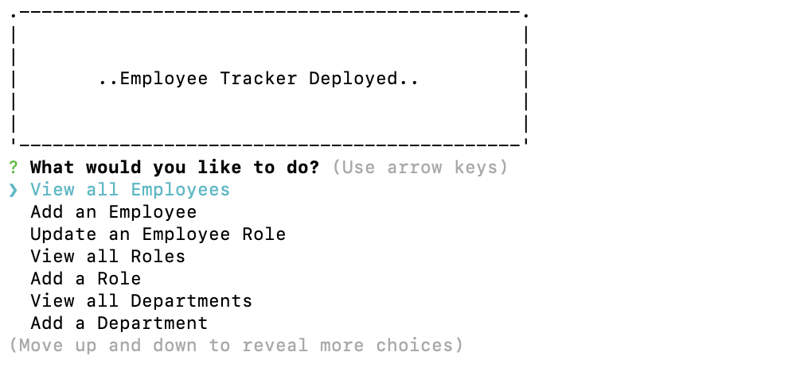

# Employee Tracker CLI Application

## Description

Employee Tracker is a Command Line Interface Application which manages a company's employee database, using Node.js, Inquirer, and MySQL.

AS A business owner
I WANT to be able to view and manage the departments, roles, and employees in my company
SO THAT I can organize and plan my business accordingly.

## Walkthrough

The following video shows an example of the application being used from the command line!

